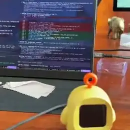
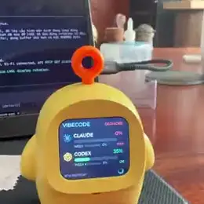
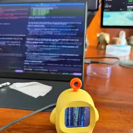
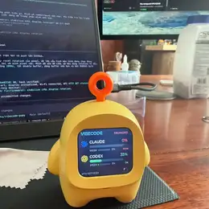
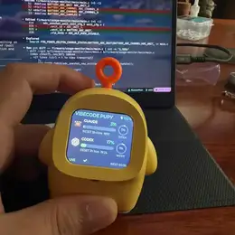

# vibecode-pupy

ESP32-S3 desk gadget that shows Claude Code and Codex usage on a small Xiaozhi-style robot display.

<p>
  <a href="docs/assets/demo/robot-demo-long.mp4"></a>
  <a href="docs/assets/demo/robot-demo-short.mp4"></a>
  <a href="docs/assets/demo/robot-usage-screen.webp"></a>
  <a href="docs/assets/demo/robot-firmware-boot.webp"></a>
  <a href="docs/assets/demo/robot-hardware-front.webp"></a>
</p>

## Architecture

```text
Claude collector + session keeper ─┐
                                   ├─> Usage API ── HTTPS ──> ESP32 firmware
Codex collector + session keeper  ─┘
```

- Public dashboard/API: `https://vibecode.sonpython.com/`
- API service: FastAPI + SQLite in `usage-api/`
- Firmware: ESP-IDF + LVGL in `firmware/usage-monitor/`
- Agent handoff: `AGENTS.md`, `docs/codex-memory.md`, `docs/session-sync.md`

## Firmware

Hardware target:

- ESP32-S3, 16 MB flash, 8 MB PSRAM
- USB serial/JTAG port: `/dev/cu.usbmodem83101`
- Display lineage: `xingzhi-cube-1.54tft-wifi`
- LCD pins: SCLK `GPIO9`, MOSI `GPIO10`, CS `GPIO14`, DC `GPIO8`, reset `GPIO18`, backlight `GPIO13`
- Power config: hold `GPIO21`, charge detect `GPIO38`, battery ADC `ADC_UNIT_2` / `ADC_CHANNEL_6`

Build and flash:

```bash
cd firmware/usage-monitor
source ~/esp/esp-idf-v5.5/export.sh
idf.py build
idf.py -p /dev/cu.usbmodem83101 flash monitor
```

Controls:

- Top button `GPIO0`: manual fetch. It keeps the current screen and only changes the bottom status to `FETCHING`.
- Reset/load button `GPIO39` or `GPIO40`: short press toggles display on/off.
- Reset/load button long press 5 seconds: starts Wi-Fi reset SoftAP `VIBECODE-PUPY-SETUP`.

## Usage API

Create local env:

```bash
cp usage-api/.env.example usage-api/.env
$EDITOR usage-api/.env
```

Run locally:

```bash
docker compose -f usage-api/docker-compose.yml up -d --build
curl http://127.0.0.1:8080/healthz
curl -H "X-Device-Secret: $DEVICE_SECRET" http://127.0.0.1:8080/status
```

Deploy target used during development:

- Docker host: `192.168.1.120`
- Public route: Cloudflare Tunnel to `vibecode.sonpython.com`

## Collectors

Claude auth is generated from a browser cURL copied from `https://claude.ai/settings/usage`:

```bash
mkdir -p secrets
pbpaste | python3 collectors/claude/parse_claude_curl.py > secrets/claude_auth.json
chmod 600 secrets/claude_auth.json
docker compose -f usage-api/docker-compose.yml up -d --build claude-collector claude-session-keeper
```

Codex auth is generated from a browser cURL for the ChatGPT/Codex usage endpoint:

```bash
mkdir -p secrets
pbpaste | python3 collectors/codex/parse_curl.py > secrets/codex_auth.json
chmod 600 secrets/codex_auth.json
docker compose -f usage-api/docker-compose.yml up -d --build codex-collector codex-session-keeper
```

## Tests

```bash
pytest -q usage-api/tests collectors/claude collectors/codex
```

Firmware verification is manual hardware validation:

```bash
cd firmware/usage-monitor
source ~/esp/esp-idf-v5.5/export.sh
idf.py build
idf.py -p /dev/cu.usbmodem83101 flash monitor
```

Expected boot logs include Wi-Fi connection, HTTP 200 from `/status`, and battery readings around `battery_raw=2450`, `battery_pct=100` when full/charging.

## Security

Never commit:

- `usage-api/.env`
- `secrets/*.json`
- Cloudflare tunnel tokens or credential JSON
- ChatGPT cookies/JWTs
- Claude cookies/session keys
- ESP32 flash backups

All credentials should stay in ignored local files or host environment variables.
